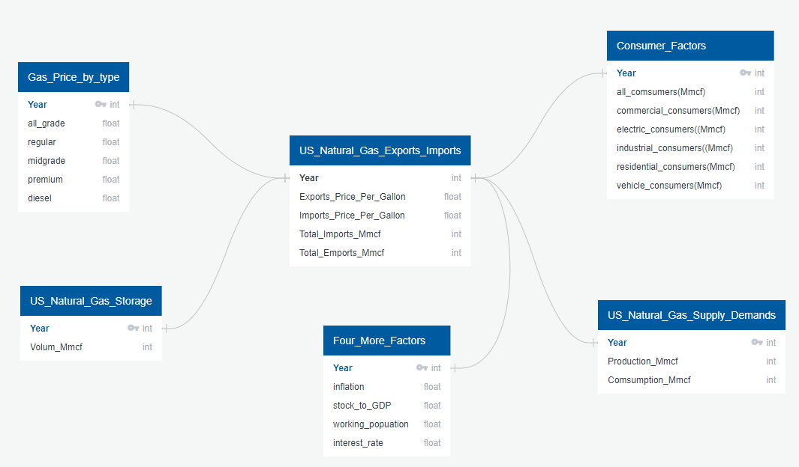

# Gas Price Prediction Analysis
## Overview of the Analysis
Our Gas Price Prediction Model will be a very convenient tool for our daily life and also for the business owners who get impacted by gas price to make better decisions.
We are happy to provide the tool that we created, so people can check the future gas prices and make their life any helpful!

## Deliverables
- Presentation
- Database
- Machine Learning Model
- Dashboard: Our version of website

## Resources 
- California_Regular_All_Formulations_Retail_Gasoline_Prices.csv :
  - https://www.eia.gov/dnav/pet/hist/LeafHandler.ashx?n=pet&s=emm_epmr_pte_sca_dpg&f=m
- U.S._All_Grades_All_Formulations_Retail_Gasoline_Prices.csv :
  - https://www.eia.gov/dnav/pet/hist/LeafHandler.ashx?n=PET&s=EMM_EPM0_PTE_NUS_DPG&f=M
- gas_prices_by_type.csv :
  - https://www.kaggle.com/datasets/mruanova/us-gasoline-and-diesel-retail-prices-19952021?select=PET_PRI_GND_DCUS_NUS_W.csv
- Price_of_U.S._Natural_Gas_Exports.csv :
  - https://www.eia.gov/dnav/ng/hist/n9130us3m.htm
- Price_of_U.S._Natural_Gas_Imports.csv :
  - https://www.eia.gov/dnav/ng/hist/n9100us3m.htm
- U.S._Natural_Gas_Exports.csv :
  - https://www.eia.gov/dnav/ng/hist/n9130us2m.htm
- U.S._Natural_Gas_Imports.csv :
  - https://www.eia.gov/dnav/ng/hist/n9100us2m.htm
- U.S._Natural_Gas_Marketed_Production.csv :
  - https://www.eia.gov/dnav/ng/hist/n9050us2m.htm
- U.S._Natural_Gas_Total_Consumption.csv: 
  - https://www.eia.gov/dnav/ng/hist/n9140us2m.htm
- U.S._Natural_Gas_Underground_Storage_Volume.csv :
  - https://www.eia.gov/dnav/ng/hist/n5030us2m.htm

## DB Diagram

## Results

## Summary

## Presentation

