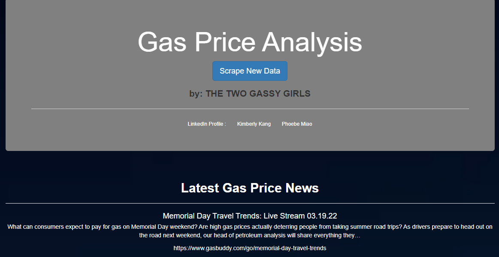

# Gas Price Analysis
## Overview of the Analysis
Gas Price Analysis project use Python, Web Scraping, and Machine Learning Model to explore the future Gas Prices in the U.S. We use the past data to perform prices forecasting. We evaluate different machine learning models to find the most accurate model for the gas prices prediction. We also provide a website for target audiences to explore the future gas prices.

## Presentation
- PowerPoint (Google Slides): https://docs.google.com/presentation/d/1XPCqnkOeaemkxZTu8BPxTlwjLJBWvVgrxnUrUHRo_xg/edit#slide=id.gc6f980f91_0_0
- Topic: Gas Price Prediction and Analysis
- Reason: After the pandemic, people are planning on going back to office. Drivers bemoan high gasoline prices. Besides, increase in gas price impacts not only on our daily life and travel, but also on various trades and industries.Through analyzing the historical natural gas datasets from the U.S., we would like to provide our analysis by using machine learning models to help people predict gas price in the future.  

- Description of the source of data
  - U.S Natural Gas Imports vs. Exports 
    - Gas Imports Price vs. Exports Price
    - Gas Total Imports vs. Exports
  - U.S Natural Gas Supply vs. Demand
    - Market Gas Production 
    - Gas Total Consumption
  - U.S Natural Gas in Storage from Underground 
  - U.S Natural Gas by Categories ($/Gallon)
    - All Grades All Formulations Retail Gasoline Prices 
    - Regular All Formulations Retail Gasoline Prices
    - Midgrade All Formulations Retail Gasoline Prices
    - Premium All Formulations Retail Gasoline Prices
    - No 2 Diesel Retail Prices
  - California Regular All_Formulations Retail Price
  - U.S Infaltion Rate
  - U.S Stock to GDP
  - U.S Working Population
  - U.S Interest Rate
  - U.S Natural Gas Deliver to Consumers (types of consumers)
    - Commercial, Electric Power, Industrial, Residential, Vehicle_Fuel
  
- ERD:

  

- Questions hope to answer with the data
  - What is the average natural gas price now and future.
  - How the natural gas price changed from the last decades.
  - Which machine learning model can help us to predict the gas price.
  - Make a better decision on energy using and planning in the future.

## Machine Learning Model Prediction
### Supervised Learning 
- Multiple Linear Regression(4 attemps with different factors)
  - MRM1: Multiple Regression Model_1
    - Factors: year, production, consumption, import_price, export_price, total imports, total exports, gas_price by types(all_grades, regular, midgrade, premium, diesel), volume(storage).
    - target: all_grades_price

  - MRM2: Multiple Regression Model_2
    - Add additional Factors: inflation, stock_to_GDP, working_population, interest_rate.
    - target: all_grades_price
        
  - MRM3: Multiple Regression Model_3
    - Drop Dummies Factors: gas_price by types(all_grades, regular, midgrade, premium, diesel)
    - target: all_grades_price
    
  - MRM4: Multiple Regression Model_4
    - Add Consumer_types: consumer_types(commercial_, elecric_, industrial_, residential_, vehicle_consumers)
    - Drop dummies: all_consumers, and gas_types_by_price 
    - target: all_grades_price
    
### Advance Machine Learning Model
- Artificial neural networks(ANN)
  - Use Sequential class and Dense class. 
    - 42 neurons in hidden layers, 22 inputs in the model
    - total 1,105 params
  - Factors: total 22 factors from our datasets.
  - Target: All_grades_gas_price

### Time Series Model
- Auto Regression Integrated Moving Average(ARIMA)
  - Monthly all_grades_gas_price from 1993 to 2022.
  - total 349month from the past to make predictions
  - consider seasonality of the dataset

### Performance of Models
#### Model Pros and Cons

     
#### Variables summary:

  
  
#### Measure Metrics:
- R-squared Score: Residual squared score that efers to the coefficient of determination. It tells how well the unknown samples will be predicted by model.(The best is 1.0, can be negative)
- MAE: Mean absolute error; the average of absolute errors off all the data points in the given dataset.
- MSE: Mean squared error; the average of the squares of the errors of all the data points in the given dataset.
- MAE*: Median of all the errors in the given dataset. (it's robust to outliers)
- EVS: Explained variance score; measures how well out model can account for the variation in the dataset. (1.0 indicatesthat model is perfect.)

## Results
1. Model Evaluation: 
   According to the model results, the ARIMA model has the highest R-squared, which indicates the model is best fit for our gasoline datasets. Comparing the mean absolute error, MRM2 has the lowest score. ARIMA has the lowest mean squared error and median absolute error. However, MRM2 has the better explained variance score. Based on the Multiple linear regression model, we have four attemps. MRM2 and MRM3 have better results, but it has trade off. The OLS Regression results show the factors in the models are not significant. 

  

2. Model intercepts and General Coefficients:   
   According to our 1st Multiple Linear-Regression Model attempt, the most impacting factors to affect the all grades gas price are: Midgrade: 84.78%, Premium: -55.64% and Diesel: 43.81%. However, the gas types are significant from the OLS regression results that indicate their p-values are zero and the R-squared is 1.0. Obviously, the gas types and all grades gas prices are correlated. On the 2nd attempt,  the most impacting factors to the all grades gas price are: Midgrade: 32.98%, Premium: 23.61% and Diesel: 6.66%. Although we added addiional factors to our dataset, the most impacting factors are still the same. In the OLS regression results, it also indicates that the gas types are significant but correlated with all grades gas price. Thus, the gas types are considered as dummy variables in our model.
   
- MRM1: intercept: 2.81
- MRM2: intercept: 2.64
- MRM3: intercept: 2.28     
- MRM4: intercept: 2.81

  
  

    In addition, we dropped the dummy factors and had 3rd attempt of multiple linear-regression model. The most impacting factor to the all grades gas priceS is **Year**, which is -11.63. Also, Inflation: 88.52%, Stock to GDP: 83.53%, and Working Population: 55.56% are the most impacting factors to the all grades gas price. From the OLS regression results, it indicates regular gas priceS and premium gas priceS are significant. Moreover, while we add additional factors : consumers' types, we drop variable all_consumers which is perfectly correlated with other factors. The most impacting factors are the total consumption: 8.93, Electic consumers: -6.5, and Industrial consumers: -2.79 that correlated with the all grades gas prices. Also, the OLS regression results indicate the p-value of residential consumers are significant. 

3. ANN Model

## Summary

## Resources
- California_Regular_All_Formulations_Retail_Gasoline_Prices.csv :
  - https://www.eia.gov/dnav/pet/hist/LeafHandler.ashx?n=pet&s=emm_epmr_pte_sca_dpg&f=m
- gas_prices_by_type.csv :
  - https://www.eia.gov/dnav/pet/pet_pri_gnd_dcus_nus_m.htm
- Price_of_U.S._Natural_Gas_Exports.csv :
  - https://www.eia.gov/dnav/ng/hist/n9130us3m.htm
- Price_of_U.S._Natural_Gas_Imports.csv :
  - https://www.eia.gov/dnav/ng/hist/n9100us3m.htm
- U.S._Natural_Gas_Exports.csv :
  - https://www.eia.gov/dnav/ng/hist/n9130us2m.htm
- U.S._Natural_Gas_Imports.csv :
  - https://www.eia.gov/dnav/ng/hist/n9100us2m.htm
- U.S._Natural_Gas_Marketed_Production.csv :
  - https://www.eia.gov/dnav/ng/hist/n9050us2m.htm
- U.S._Natural_Gas_Total_Consumption.csv: 
  - https://www.eia.gov/dnav/ng/hist/n9140us2m.htm
- U.S._Natural_Gas_Underground_Storage_Volume.csv :
  - https://www.eia.gov/dnav/ng/hist/n5030us2m.htm

## Webscriping
- Main page:
  
  
- Webscriping details:
  - MongoDB database(storage data)
  - Latest New of U.S Gas Price
- Graphs and results from ML model

### Roles for Analysis
- Contributors
  - Phoebe J.Miao: responsible for repository, design machine learning model and create a diagram explains ML model within the project scope. Data preprocessing and cleaning. Decide analysis technologies to be used for each steps of the project. Organize all regression results and summarize them in readme file. Add contents into the PowerPoint file.
  - Kimberly Kang: create a mockup of a database with a set of sample data to ensure that the datasets are sourced and are able to be loaded from database. Responsible for dataset updates, download, and ERDs to give a big picture of dataset. Decide analysis technologies to be used for each step of the project. Build html, app.py, scraping.py, and Python coding for scraping latest Gas Price news articles. Preprare a PowerPoint structure.
