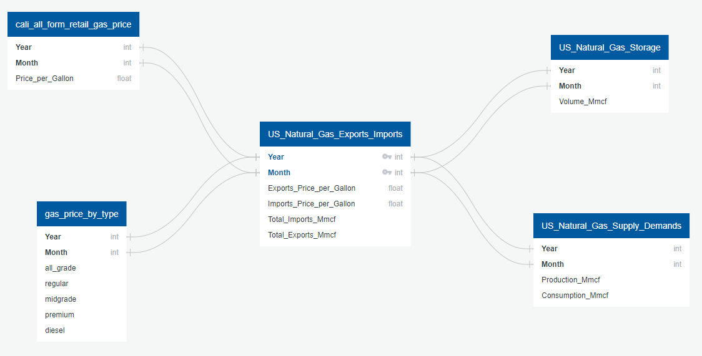

# Gas Price Prediction Analysis
## Overview of the Analysis
Our Gas Price Prediction Model will be a very convenient tool for our daily life and also for the business owners who get impacted by gas price to make better decisions.
We are happy to provide the tool that we created, so people can check the future gas prices and make their life any helpful!

## Deliverables
- Presentation
- Database
- Machine Learning Model
- Dashboard: Our version of website

## Resources 
  - Tools that we used: Jupyter Notebook(Python), VS Code, and pdAdmin
- "natural_gas_consumption_monthly_since2001.csv": http://www.eia.gov/dnav/ng/hist/n9140us2m.htm - shows data for U.S. natural gas CONSUMPTION by end use by month since 2001. 
- "U.S.Imports_of_Total_Gasoline_Weekly.csv": https://www.eia.gov/opendata/qb.php?sdid=PET.WGTIMUS2.W - shows data for U.S. IMPORTS of total gas by week from 1982 till April 2022. 
- "U.S._All_Grades_All_Formulations_Retail_Gasoline_Prices_Weekly.csv": https://www.eia.gov/opendata/qb.php?category=240692&sdid=PET.EMM_EPM0_PTE_NUS_DPG.W - shows data for retail gas PRICES by week 
- "gas_prices_by_type.csv": https://www.kaggle.com/datasets/mruanova/us-gasoline-and-diesel-retail-prices-19952021?select=PET_PRI_GND_DCUS_NUS_W.csv
- "Gas consumption by country.csv": https://www.kaggle.com/datasets/elgunisgandarli/oilgas-production-and-consumption?select=Gas+consumption+by+country.csv
- "Gas production by country.csv": https://www.kaggle.com/datasets/elgunisgandarli/oilgas-production-and-consumption?select=Gas+consumption+by+country.csv
- "Gas consumption per capita.csv": https://www.kaggle.com/datasets/elgunisgandarli/oilgas-production-and-consumption?select=Gas+consumption+by+country.csv
- "Weekly_California_Regular_All_Formulations_Retail_Gasoline_Prices.csv": https://www.eia.gov/dnav/pet/hist/LeafHandler.ashx?n=PET&s=EMM_EPMR_PTE_SCA_DPG&f=W

## DB Diagram

## Results

## Summary

## Presentation

