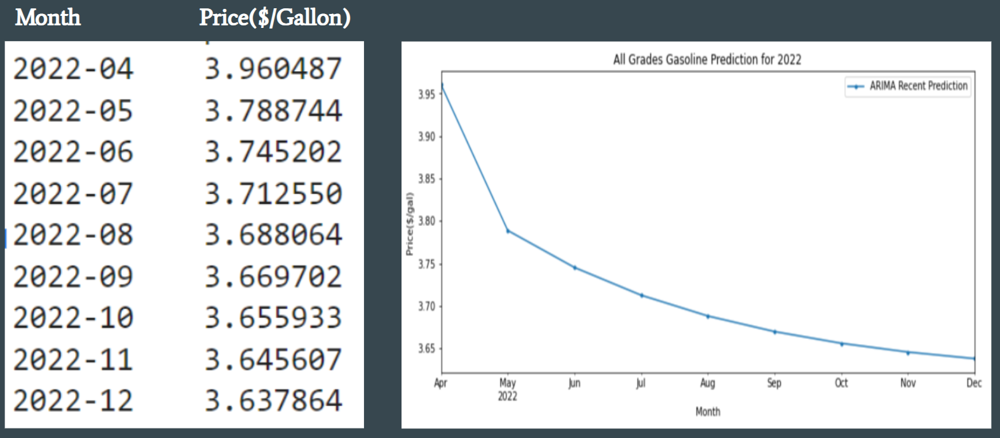

# Gas Price Analysis
## Overview of the Analysis
Our Gas Price Analysis uses Python, Web Scraping, and Machine Learning to explore the past Gas Prices in the U.S. and forecast future gas prices. We performed visualization from our findings based on the various factors that we thought could affect the future gas prices. Later, we would like to show you our website that we created.

## Presentation
- PowerPoint (Google Slides): https://docs.google.com/presentation/d/1XPCqnkOeaemkxZTu8BPxTlwjLJBWvVgrxnUrUHRo_xg/edit#slide=id.gc6f980f91_0_0
- Video Link: https://youtu.be/uE14fkmyN1U
- Our website: https://gas-price-analysis.herokuapp.com/
- Topic: Gas Price Prediction and Analysis
- Reason: After the pandemic, people are planning to go back to the office. Drivers bemoan high gasoline prices. Besides, an increase in gas price impacts not only on our daily life and travel, but also on various trades and industries. Through analyzing the historical natural gas datasets from the U.S., we would like to provide our analysis by using machine learning models to show our prediction on future gas prices.  

- Description of the source of data
  - U.S Natural Gas Imports vs. Exports 
    - Gas Imports Price vs. Exports Price
    - Gas Total Imports vs. Exports
  - U.S Natural Gas Supply vs. Demand
    - Market Gas Production 
    - Gas Total Consumption
  - U.S Natural Gas in Storage from Underground 
  - U.S Natural Gas by Categories ($/Gallon)
    - All Grades All Formulations Retail Gasoline Prices 
    - Regular All Formulations Retail Gasoline Prices
    - Midgrade All Formulations Retail Gasoline Prices
    - Premium All Formulations Retail Gasoline Prices
    - No 2 Diesel Retail Prices
  - California Regular All_Formulations Retail Price
  - U.S Infaltion Rate
  - U.S Stock to GDP
  - U.S Working Population
  - U.S Interest Rate
  - U.S Natural Gas Deliver to Consumers (types of consumers)
    - Commercial, Electric Power, Industrial, Residential, Vehicle_Fuel
  
- ERD:

  

- Questions hope to answer with the data
  - What is the average natural gas price now and in the future?
  - How did the natural gas price change from the last decade?
  - Which machine learning model can help us predict the gas price?
 

## Machine Learning Approaches
### Model Designs 
1. Multiple Linear Regression(4 attemps with different factors)
  - MRM1: Multiple Regression Model_1
    - Factors: year, production, consumption, import_price, export_price, total imports, total exports, gas_price by types(all_grades, regular, midgrade, premium, diesel), volume(storage).
    - target: all_grades_price

  - MRM2: Multiple Regression Model_2
    - Add additional Factors: inflation, stock_to_GDP, working_population, interest_rate.
    - target: all_grades_price
        
  - MRM3: Multiple Regression Model_3
    - Drop Dummies Factors: gas_price by types(all_grades, regular, midgrade, premium, diesel)
    - target: all_grades_price
    
  - MRM4: Multiple Regression Model_4
    - Add Consumer_types: consumer_types(commercial_, elecric_, industrial_, residential_, vehicle_consumers)
    - Drop dummies: all_consumers, and gas_types_by_price 
    - target: all_grades_price
    
2. Artificial neural networks(ANN)
  - Use Sequential class and Dense class. 
    - 42 neurons in hidden layers, 22 inputs in the model
    - total 1,105 params
  - Factors: total 22 factors from our datasets.
  - Target: All_grades_gas_price

3. Time Series Model
- Auto Regression Integrated Moving Average(ARIMA)
  - Monthly all_grades_gas_price from 1993 to 2022.
  - total 349month from the past to make predictions
  - consider seasonality of the dataset

### Data Preparation and Description of Models
#### Datasets summary:

  
#### Model Pros and Cons

     

#### Models Evaluation Metrics:
- R-squared Score: Residual squared score that refers to the coefficient of determination. It tells how well the unknown samples will be predicted by model.(The best is 1.0, can be negative)
- MAE: Mean absolute error; the average of absolute errors off all the data points in the given dataset.
- MSE: Mean squared error; the average of the squares of the errors of all the data points in the given dataset.
- MAE*: Median of all the errors in the given dataset. (it's robust to outliers)
- EVS: Explained variance score; measures how well out model can account for the variation in the dataset. (1.0 indicatesthat model is perfect.)

## Results
1. Models Evaluations: 

   Overall models we have applied, the ARIMA model has the highest R-squared score of 92%, which indicates this model is the best fit for our gasoline datasets. Comparing to the Linear Regression Models, ARIMA has the lowest mean squared error and the lowest median absolute error even though the mean absolute error for MRM2 has the lowest score and explained the variance score better. Besides, we have four attemps on Linear Regression Models with different factors. Among those attemps, MRM2 and MRM3 have better results but there is some trade-off. The OLS Regression results show the factors(not including dummies) for all attemps are not significant. 
   

  

2. Model intercepts and General Coefficients:   

   According to our 1st Multiple Linear-Regression Model attempt, the most impacting factors to affect the all grades gas price are: Midgrade: 84.78%, Premium: -55.64% and Diesel: 43.81%. However, the gas types are significant from the OLS regression results that indicate their p-values are zero and the R-squared is 1.0. Obviously, the gas types and all grades gas prices are correlated. On the 2nd attempt,  the most impacting factors to the all grades gas price are: Midgrade: 32.98%, Premium: 23.61% and Diesel: 6.66%. Although we added addiional factors to our dataset, the most impacting factors are still the same. The OLS regression result also indicates that the gas types are significant but are correlated with all grades gas prices. Thus, the gas types are considered as dummy variables in our model. For more information, see the following:
  
  - MRM1: intercept: 2.81
  - MRM2: intercept: 2.64
  - MRM3: intercept: 2.28     
  - MRM4: intercept: 2.81

  

  

  
  In addition, we dropped the dummy factors and had 3rd attempt of multiple linear-regression model. The most impacting factor to the all grades gas prices was **Year**, which was -11.63. Also, Inflation: 88.52%, Stock to GDP: 83.53%, and Working Population: 55.56% are the most impacting factors to the all grades gas prices. From the OLS regression result, it indicates regular gas prices and premium gas prices are significant. Moreover, while we added additional factors : consumers' types, we dropped a variable of all_consumers which is perfectly correlated with other factors. The most impacting factors are the total consumption: 8.93, Electic consumers: -6.5, and Industrial consumers: -2.79 that is correlated with the all grades gas prices. Also, the OLS regression result indicates that the p-value of residential consumers are significant. 

3. Determine the best Machine Learning Model

    We compared three types of machine learning models: Multiple Linear Regression, ANN, and ARIMA. The best result is the ARIMA model, which has the smallest errors such as MAE, MSE, MAE*, that could be used to understand the patterns in gas prices better. Using sample data to train and test the model, we obtained the expected result. The trend in the future gas prices almost overlap with the actual gas prices. Since the ARIMA model results indicate all the lags we tested are significant with R-squared score of 92%, we can conclude that the ARIMA model is our best fit to forecast the future gas prices. As we could see the graph below:
  

## Summary
Because of what's going on with gas price increases nowadays, we wanted to perform an analysis on Gas Price and try to forecast future gas prices by using Machine Learning Models. We found out that ARIMA model would describe our future gas prices the best. Based on the graph below, we can expect our future gas prices to go down for the rest of the year.

 

## Resources
- California_Regular_All_Formulations_Retail_Gasoline_Prices.csv :
  - https://www.eia.gov/dnav/pet/hist/LeafHandler.ashx?n=pet&s=emm_epmr_pte_sca_dpg&f=m
- gas_prices_by_type.csv :
  - https://www.eia.gov/dnav/pet/pet_pri_gnd_dcus_nus_m.htm
- Price_of_U.S._Natural_Gas_Exports.csv :
  - https://www.eia.gov/dnav/ng/hist/n9130us3m.htm
- Price_of_U.S._Natural_Gas_Imports.csv :
  - https://www.eia.gov/dnav/ng/hist/n9100us3m.htm
- U.S._Natural_Gas_Exports.csv :
  - https://www.eia.gov/dnav/ng/hist/n9130us2m.htm
- U.S._Natural_Gas_Imports.csv :
  - https://www.eia.gov/dnav/ng/hist/n9100us2m.htm
- U.S._Natural_Gas_Marketed_Production.csv :
  - https://www.eia.gov/dnav/ng/hist/n9050us2m.htm
- U.S._Natural_Gas_Total_Consumption.csv: 
  - https://www.eia.gov/dnav/ng/hist/n9140us2m.htm
- U.S._Natural_Gas_Underground_Storage_Volume.csv :
  - https://www.eia.gov/dnav/ng/hist/n5030us2m.htm

## Webscriping
- Link: https://gas-price-analysis.herokuapp.com/

- Main page: 
 

    

  
- Webscriping details:

  

  
  - MongoDB database(storage data)
  - Latest Gasoline Prices in 2022
  - Graphs and results from ML model

### Roles for Analysis
- Contributors
  - Phoebe J.Miao: responsible for repository, design machine learning model and create a diagram explains ML model within the project scope. Data preprocessing and cleaning. Decide analysis technologies to be used for each steps of the project. Organize all regression results and summarize them in readme file. Add contents into the PowerPoint file.
  - Kimberly Kang: created a mockup of a database with a set of sample data to ensure that the datasets are sourced and are able to be loaded from database. Responsible for dataset updates, download, and ERDs to give a big picture of our dataset. Decided analysis technologies to be used for each step of the project. Built the html, app.py, scraping.py, and Python coding for web scraping of the latest Gas Price news articles. Preprared the PowerPoint structure.
